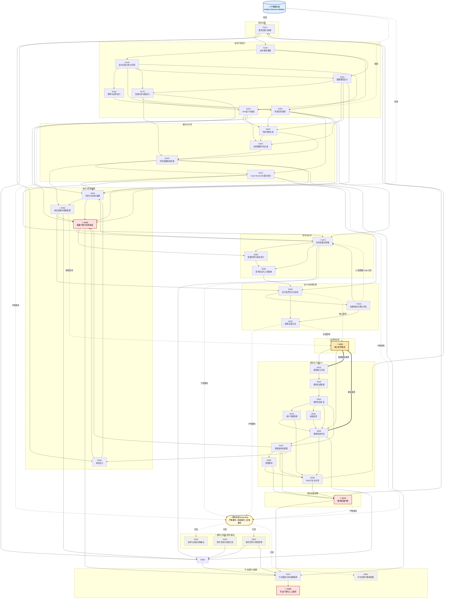

# Skills 流程优化方案 v2 · Reactive Edition

> **From Static DAG → Reactive Event-Driven System**
> 
> 在 v1 流程基础上引入 **事件总线**、**产物契约**、**渐进门禁**、**反馈回流**、**熔断保护**、**分层路由**、**SLA 人工队列** 七项核心改造,把"被动执行的 DAG"升级为"主动感知的反应式系统"。

---

## 📊 核心指标

| 指标 | 数值 | 说明 |
|---|---|---|
| 新增节点 | **+1** | N005 线上信号聚合 |
| 核心优化项 | **7** | 覆盖契约、门禁、事件、反馈、路由、熔断、SLA |
| 横切订阅者 | **4** | 文档/协同/任务/治理 改为事件驱动 |
| 节点总数 | **40** | 主流程 36 + 横切 4 |
| 阶段总数 | **12** | 新增"反馈回流层" |
| 新基础设施 | **3** | 事件总线 + 契约层 + SLA 队列 |

---

## 🎯 七项优化总览

| 优先级 | 优化项 | 核心改造 | 收益 |
|---|---|---|---|
| 🔴 **P0** | 优化 02 · 📜 产物契约层 | 字符串文件名 → 带 Schema/版本号的契约对象 | 改字段必升版本,下游可感知 |
| 🔴 **P0** | 优化 06 · 🚦 渐进式门禁 | 检查能力下沉到每个节点(节点自检) | 问题在节点内修复,不流转下游 |
| 🟠 **P1** | 优化 01 · ⚡ 事件总线 | 横切层从 DAG 末尾改为事件订阅者 | 文档不再滞后于代码 |
| 🟠 **P1** | 优化 04 · 🔄 线上反馈回流 | 新增 N005 聚合监控/复盘/缺陷/NPS | 数据驱动产品决策 |
| 🔵 **P2** | 优化 03 · 🎯 三层分层路由 | 阶段 → 节点 → 节点内,每层 ≤11 选 1 | 路由准确率显著提升 |
| 🔵 **P2** | 优化 07 · 👥 人工 SLA 队列 | 优先级 + SLA + 推荐动作 + 自动升级 | 人不再被淹没 |
| ⚫ **P3** | 优化 05 · ⚡ 回环熔断器 | max_iter + cooldown + 自动升级 | 防止"修一次坏一次"死循环 |

---

## 🗺️ 全局拓扑图



### 图例

| 标识 | 含义 |
|---|---|
| ✨ 黄色描边 | 新增节点 (N005) |
| 🚦 红色描边 | 渐进门禁汇总 (N100/N260/N380) |
| ⚡ 黄色椭圆 | 事件总线 |
| 📜 蓝色双圈 | 产物契约校验层 |
| 灰色虚线框 | 事件订阅者(横切层) |
| `==粗实线==>` | 数据驱动反馈环 |
| `-.虚线.->` | 事件 / 信号流 |

---

## 🏛️ 参考架构

```
                    ┌─────────────────────────────────────────────┐
                    │       ⚡ 事件总线 (Event Bus)                │
                    │  produced.* / state.* / exception.* / sla.*  │
                    └─┬───────────┬───────────┬───────────┬───────┘
                      │ subscribe │           │           │
        ┌─────────────┘           │           │           └────────────┐
        ▼                         ▼           ▼                        ▼
  ┌──────────┐            ┌──────────┐  ┌──────────┐          ┌──────────────┐
  │ N330     │            │ N340     │  │ N350     │          │ N390         │
  │ 文档生成  │            │ 协同沉淀  │  │ 任务管理  │          │ 治理审计      │
  └──────────┘            └──────────┘  └──────────┘          └──────────────┘

  ════════════════════════════════════════════════════════════════════════════

   主流程 DAG (N005 ─ N320)                          📜 产物契约层
   ┌──────────────────────────────┐                 ┌─────────────────┐
   │ N005 ─► N010 ─► ... ─► N320  │ ◄─── 校验 ───   │ Schema Registry │
   └──────────────────────────────┘                 │ + Versioning    │
                                                    └─────────────────┘
   每个节点 → 触发 produced 事件 → 事件总线 → 横切订阅者实时响应

  ════════════════════════════════════════════════════════════════════════════

   🔄 反馈回流环                              🎯 N370 三层路由
   N300/N320/N250 ─signal─► N005 ─► N010      Stage → Node → Skill
                                  └► N060      (130+ → 11 → 3-4 → N)

  ════════════════════════════════════════════════════════════════════════════

   ⚡ 熔断器                                  👥 SLA 人工队列
   max_iter:3 + cooldown:30m + escalate     P0/P1/P2 + SLA + auto-escalate
```

---

## 📚 阶段索引

| # | 阶段 | 英文 | 节点数 | 跳转 |
|---|---|---|---|---|
| 1 | 🔄 **反馈回流层** | Production Signal Loop · 新增 | 1 | [↓](#5-反馈回流层) |
| 2 | 📋 **需求与产品定义** | Requirement & Product Definition | 9 | [↓](#10-需求与产品定义) |
| 3 | 🛡️ **需求质量保障** | Requirement Quality Assurance | 1 | [↓](#100-需求质量保障) |
| 4 | 🤝 **协同交接** | Handover | 1 | [↓](#110-协同交接) |
| 5 | 🏗️ **技术方案设计** | Technical Solution Design | 7 | [↓](#120-技术方案设计) |
| 6 | ⚙️ **编码与实现** | Coding & Implementation | 4 | [↓](#190-编码与实现) |
| 7 | 🧪 **测试与质量保障** | Testing & QA | 4 | [↓](#230-测试与质量保障) |
| 8 | 🚀 **发布与交付** | Release & Delivery | 3 | [↓](#270-发布与交付) |
| 9 | 📡 **运行与故障处理** | Operations & Incident | 3 | [↓](#300-运行与故障处理) |
| 10 | 📚 **文档与知识沉淀** | Documentation [事件订阅] | 2 | [↓](#330-文档与知识沉淀) |
| 11 | 🔗 **协同与管理** | Coordination [事件订阅] | 2 | [↓](#350-协同与管理) |
| 12 | 🧠 **平台底座与编排** | Platform Foundation | 3 | [↓](#370-平台底座与编排) |

---

## 🔍 节点详情

### 🔄 005 · 反馈回流层
<a id="5-反馈回流层"></a>

> *Production Signal Loop · 新增* · 共 **1** 个节点

#### `N005` · 线上信号聚合

**能力标签**:✨ **NEW**

**子阶段**:信号回流  
**节点目标**:聚合线上监控、复盘、缺陷、用户反馈,反推数据驱动的需求假设

**📥 输入产物 (Inputs)**

  - `高频报错摘要.md`
  - `故障复盘.md`
  - `缺陷分类表.csv`
  - `用户反馈/NPS`

**⚙️ 调用 Skills (3)**

`production-signal-aggregation` `data-driven-requirement-mining` `user-feedback-clustering`

**📤 输出产物 (Outputs)**

  - `线上痛点信号包.json`
  - `数据驱动需求建议.csv`

**→ 下游节点**:`N010`, `N060`

---

### 📋 010 · 需求与产品定义
<a id="10-需求与产品定义"></a>

> *Requirement & Product Definition* · 共 **9** 个节点

#### `N010` · 需求输入归档

**子阶段**:需求收集  
**节点目标**:汇总多来源需求并形成统一编号的原始需求输入包

**📥 输入产物 (Inputs)**

  - `原始需求列表`
  - `会议纪要`
  - `客诉/反馈记录`
  - `原型链接/截图`

**⚙️ 调用 Skills (1)**

`requirement-collection-consolidation`

**📤 输出产物 (Outputs)**

  - `原始需求池.csv`
  - `需求来源索引.md`

**→ 下游节点**:`N020`

---

#### `N020` · 需求去重聚类

**子阶段**:需求收集  
**节点目标**:识别重复需求、归并相似诉求并输出主题分组

**📥 输入产物 (Inputs)**

  - `原始需求池.csv`
  - `需求来源索引.md`

**⚙️ 调用 Skills (1)**

`requirement-deduplication-and-clustering`

**📤 输出产物 (Outputs)**

  - `需求去重结果.csv`
  - `需求主题聚类表.csv`

**→ 下游节点**:`N030`

---

#### `N030` · 需求背景补全

**子阶段**:需求分析  
**节点目标**:补齐业务背景、目标、角色、场景、范围边界和待确认问题

**📥 输入产物 (Inputs)**

  - `需求去重结果.csv`
  - `需求主题聚类表.csv`
  - `PRD/草案.md`

**⚙️ 调用 Skills (1)**

`requirement-context-enrichment`

**📤 输出产物 (Outputs)**

  - `需求背景卡.md`
  - `待确认问题清单.csv`

**→ 下游节点**:`N040`, `N050`, `N060`, `N070`

---

#### `N040` · 用户问题洞察

**子阶段**:用户研究  
**节点目标**:提炼用户痛点、用户旅程断点和影响范围

**📥 输入产物 (Inputs)**

  - `需求背景卡.md`
  - `用户反馈摘录.md`

**⚙️ 调用 Skills (2)**

`user-journey-analysis` `user-pain-point-analysis`

**📤 输出产物 (Outputs)**

  - `用户痛点卡.md`
  - `用户旅程断点表.csv`

**→ 下游节点**:`N060`, `N090`

---

#### `N050` · 竞品研究

**子阶段**:市场研究  
**节点目标**:形成竞品能力扫描与功能对标结果，为后续规划提供外部参照

**📥 输入产物 (Inputs)**

  - `需求背景卡.md`
  - `竞品资料.md/链接`

**⚙️ 调用 Skills (2)**

`competitor-analysis` `competitor-feature-benchmarking`

**📤 输出产物 (Outputs)**

  - `竞品能力扫描表.csv`
  - `竞品功能对标表.csv`

**→ 下游节点**:`N060`

---

#### `N060` · 需求规划评估

**子阶段**:需求规划  
**节点目标**:综合价值、成本、风险与优先级，形成需求规划建议

**📥 输入产物 (Inputs)**

  - `需求背景卡.md`
  - `用户痛点卡.md`
  - `竞品能力扫描表.csv`

**⚙️ 调用 Skills (4)**

`requirement-value-assessment` `requirement-priority-assessment` `requirement-cost-estimation` `requirement-risk-assessment`

**📤 输出产物 (Outputs)**

  - `需求价值评估表.csv`
  - `需求成本预估表.csv`
  - `需求风险预判表.csv`
  - `需求优先级建议.csv`

**→ 下游节点**:`N070`, `N090`, `N360`

---

#### `N070` · 需求结构化建模

**能力标签**:🔍 节点自检 *(优化6 渐进门禁)*

**子阶段**:需求结构化  
**节点目标**:将需求拆成功能、规则、状态、权限和数据对象等可交付结构

**📥 输入产物 (Inputs)**

  - `需求背景卡.md`
  - `需求优先级建议.csv`
  - `PRD/草案.md`

**⚙️ 调用 Skills (5)**

`business-rule-extraction` `data-object-identification` `permission-matrix-extraction` `state-transition-mapping` `requirement-breakdown`

**📤 输出产物 (Outputs)**

  - `需求结构树.md`
  - `业务规则清单.csv`
  - `状态流转表.csv`
  - `权限矩阵.csv`
  - `数据对象清单.csv`

**→ 下游节点**:`N080`, `N090`, `N100`, `N230`, `N260`

---

#### `N080` · 原型解析

**能力标签**:🔍 节点自检 *(优化6 渐进门禁)*

**子阶段**:原型理解  
**节点目标**:从页面原型中提取功能点、动作、字段与后端需求

**📥 输入产物 (Inputs)**

  - `原型链接/截图`
  - `需求背景卡.md`
  - `需求结构树.md`

**⚙️ 调用 Skills (4)**

`prototype-to-feature-points` `prototype-to-backend-requirements` `form-field-extraction` `page-action-extraction`

**📤 输出产物 (Outputs)**

  - `原型功能点表.csv`
  - `页面动作表.csv`
  - `表单字段清单.csv`
  - `原型后端需求清单.csv`

**→ 下游节点**:`N090`, `N100`

---

#### `N090` · PRD产出与评审

**能力标签**:🔍 节点自检 *(优化6 渐进门禁)*

**子阶段**:文档产出  
**节点目标**:生成结构化PRD、补全缺项并产出评审问题

**📥 输入产物 (Inputs)**

  - `需求结构树.md`
  - `业务规则清单.csv`
  - `状态流转表.csv`
  - `权限矩阵.csv`
  - `原型功能点表.csv`

**⚙️ 调用 Skills (3)**

`prd-generation` `prd-completion` `prd-review-question-generation`

**📤 输出产物 (Outputs)**

  - `PRD.md`
  - `PRD补全建议.md`
  - `PRD评审问题清单.csv`

**→ 下游节点**:`N100`, `N110`

---

### 🛡️ 100 · 需求质量保障
<a id="100-需求质量保障"></a>

> *Requirement Quality Assurance* · 共 **1** 个节点

#### `N100` · 需求质量门禁

**能力标签**:🚦 汇总门禁 *(优化6 渐进门禁)* · 📊 聚合判定 *(优化6 渐进门禁)*

**子阶段**:质量审查  
**节点目标**:检查需求完整性、可执行性、一致性、漏洞和未决项，并给出放行结论

**📥 输入产物 (Inputs)**

  - `PRD.md`
  - `需求结构树.md`
  - `业务规则清单.csv`
  - `状态流转表.csv`
  - `权限矩阵.csv`

**⚙️ 调用 Skills (6)**

`pending-items-extraction` `requirement-executability-check` `requirement-completeness-check` `requirement-vulnerability-scan` `requirement-conflict-detection` `requirement-quality-review`

**📤 输出产物 (Outputs)**

  - `完整性检查单.csv`
  - `可执行性检查单.csv`
  - `需求矛盾问题单.csv`
  - `需求漏洞清单.csv`
  - `待确认项清单.csv`
  - `需求质量审查单.md`

**→ 下游节点**:`N110`, `N370`

---

### 🤝 110 · 协同交接
<a id="110-协同交接"></a>

> *Handover* · 共 **1** 个节点

#### `N110` · 需求交接与验收

**子阶段**:交接与变更  
**节点目标**:产出研发/测试可消费的交接包、验收标准及变更同步信息

**📥 输入产物 (Inputs)**

  - `PRD.md`
  - `需求质量审查单.md`
  - `需求结构树.md`
  - `业务规则清单.csv`

**⚙️ 调用 Skills (5)**

`engineering-feedback-return` `handover-package-generation` `requirement-change-sync` `requirement-change-impact-analysis` `acceptance-criteria-generation`

**📤 输出产物 (Outputs)**

  - `需求交接包.zip`
  - `验收标准.md`
  - `需求变更影响分析.md`
  - `需求变更同步通知.md`
  - `研发反馈回传单.md`

**→ 下游节点**:`N120`, `N230`, `N350`, `N360`

---

### 🏗️ 120 · 技术方案设计
<a id="120-技术方案设计"></a>

> *Technical Solution Design* · 共 **7** 个节点

#### `N120` · 技术需求理解

**子阶段**:研发理解  
**节点目标**:将产品需求翻译成研发问题空间并抽取接口意图

**📥 输入产物 (Inputs)**

  - `需求交接包.zip`
  - `需求质量审查单.md`
  - `验收标准.md`

**⚙️ 调用 Skills (2)**

`engineering-requirement-parsing` `api-intent-extraction`

**📤 输出产物 (Outputs)**

  - `开发需求解析.md`
  - `接口意图清单.csv`

**→ 下游节点**:`N130`, `N150`, `N160`

---

#### `N130` · 技术方案分析与评审

**能力标签**:🔍 节点自检 *(优化6 渐进门禁)*

**子阶段**:方案输出  
**节点目标**:产出技术方案分析、初稿和评审问题

**📥 输入产物 (Inputs)**

  - `开发需求解析.md`
  - `接口意图清单.csv`
  - `需求漏洞清单.csv`

**⚙️ 调用 Skills (3)**

`technical-solution-analysis` `technical-solution-draft-generation` `solution-review-question-generation`

**📤 输出产物 (Outputs)**

  - `技术方案分析.md`
  - `技术方案初稿.md`
  - `方案评审问题清单.csv`

**→ 下游节点**:`N140`, `N150`, `N160`, `N170`, `N180`, `N330`

---

#### `N140` · 架构与边界设计

**子阶段**:架构拆分  
**节点目标**:识别模块边界并给出服务拆分建议

**📥 输入产物 (Inputs)**

  - `技术方案分析.md`

**⚙️ 调用 Skills (2)**

`service-decomposition-recommendation` `module-boundary-identification`

**📤 输出产物 (Outputs)**

  - `模块边界图.md`
  - `服务拆分建议.md`

**→ 下游节点**:`N180`

---

#### `N150` · API设计与校验

**能力标签**:🔍 节点自检 *(优化6 渐进门禁)*

**子阶段**:API设计  
**节点目标**:形成接口契约、规范检查结果和错误码设计

**📥 输入产物 (Inputs)**

  - `开发需求解析.md`
  - `接口意图清单.csv`
  - `技术方案分析.md`

**⚙️ 调用 Skills (3)**

`api-spec-compliance-check` `api-error-code-design` `api-design-recommendation`

**📤 输出产物 (Outputs)**

  - `接口设计草案.yaml`
  - `API规范检查单.csv`
  - `错误码清单.csv`

**→ 下游节点**:`N190`, `N200`, `N240`, `N330`

---

#### `N160` · 数据模型设计

**子阶段**:数据设计  
**节点目标**:形成表结构、索引与数据流设计

**📥 输入产物 (Inputs)**

  - `开发需求解析.md`
  - `技术方案分析.md`
  - `数据对象清单.csv`

**⚙️ 调用 Skills (3)**

`data-flow-mapping` `index-design-recommendation` `table-schema-design-recommendation`

**📤 输出产物 (Outputs)**

  - `表结构设计草案.sql`
  - `索引建议清单.csv`
  - `数据流图.md`

**→ 下游节点**:`N170`, `N190`, `N200`, `N260`, `N330`

---

#### `N170` · 高级与非功能设计

**子阶段**:高级设计  
**节点目标**:补齐并发、幂等、审计、权限、性能和安全设计

**📥 输入产物 (Inputs)**

  - `技术方案分析.md`
  - `需求漏洞清单.csv`
  - `表结构设计草案.sql`
  - `权限矩阵.csv`

**⚙️ 调用 Skills (6)**

`security-risk-analysis` `audit-trail-design` `idempotency-design-recommendation` `concurrency-control-recommendation` `performance-risk-analysis` `authorization-model-design`

**📤 输出产物 (Outputs)**

  - `并发控制建议.md`
  - `幂等设计建议.md`
  - `审计留痕方案.md`
  - `权限模型设计.md`
  - `性能风险分析.md`
  - `安全风险分析.md`

**→ 下游节点**:`N180`, `N210`, `N260`, `N390`

---

#### `N180` · 研发任务规划

**子阶段**:任务管理  
**节点目标**:将方案转成开发任务、工时和依赖关系

**📥 输入产物 (Inputs)**

  - `技术方案分析.md`
  - `模块边界图.md`
  - `服务拆分建议.md`
  - `数据流图.md`

**⚙️ 调用 Skills (3)**

`dependency-identification` `effort-estimation-assistant` `development-task-breakdown`

**📤 输出产物 (Outputs)**

  - `开发任务拆分表.csv`
  - `工时估算表.csv`
  - `研发依赖清单.csv`

**→ 下游节点**:`N190`, `N220`, `N240`, `N270`, `N330`, `N350`

---

### ⚙️ 190 · 编码与实现
<a id="190-编码与实现"></a>

> *Coding & Implementation* · 共 **4** 个节点

#### `N190` · 代码骨架生成

**能力标签**:🔍 节点自检 *(优化6 渐进门禁)*

**子阶段**:脚手架生成  
**节点目标**:生成工程骨架及控制器、服务、仓储层基础代码草稿

**📥 输入产物 (Inputs)**

  - `技术方案分析.md`
  - `接口设计草案.yaml`
  - `表结构设计草案.sql`

**⚙️ 调用 Skills (4)**

`controller-draft-generation` `repository-draft-generation` `service-draft-generation` `code-scaffold-generation`

**📤 输出产物 (Outputs)**

  - `工程骨架.zip`
  - `Controller草稿.java`
  - `Service草稿.java`
  - `Repository草稿.java`

**→ 下游节点**:`N200`, `N210`

---

#### `N200` · 实现辅助代码生成

**能力标签**:🔍 节点自检 *(优化6 渐进门禁)*

**子阶段**:代码生成  
**节点目标**:生成DTO/VO、枚举、校验器、异常类与SQL草稿，并给出查询优化建议

**📥 输入产物 (Inputs)**

  - `接口设计草案.yaml`
  - `业务规则清单.csv`
  - `错误码清单.csv`
  - `表结构设计草案.sql`

**⚙️ 调用 Skills (6)**

`dto-vo-generation` `sql-draft-generation` `exception-class-generation` `enum-definition-generation` `query-optimization-recommendation` `validator-code-generation`

**📤 输出产物 (Outputs)**

  - `DTO_VO草稿.zip`
  - `枚举定义.java`
  - `校验器代码.java`
  - `异常类.java`
  - `SQL草稿.sql`
  - `查询优化建议.md`

**→ 下游节点**:`N210`, `N330`

---

#### `N210` · 代码质量静态检查

**子阶段**:代码质量  
**节点目标**:检查规范、命名、重复、异常、事务和线程安全风险

**📥 输入产物 (Inputs)**

  - `工程骨架.zip`
  - `Service草稿.java`
  - `并发控制建议.md`
  - `技术方案分析.md`

**⚙️ 调用 Skills (8)**

`transaction-boundary-check` `code-standard-check` `low-quality-code-detection` `naming-optimization-recommendation` `null-exception-risk-detection` `thread-safety-risk-check` `duplicate-code-detection` `refactoring-recommendation`

**📤 输出产物 (Outputs)**

  - `代码规范检查单.csv`
  - `重构建议.md`
  - `命名优化建议.md`
  - `低质量代码清单.csv`
  - `重复代码清单.csv`
  - `风险检查清单.csv`

**→ 下游节点**:`N220`, `N250`, `N260`, `N370`, `N390`

---

#### `N220` · Code Review与提交协同

**子阶段**:Code Review  
**节点目标**:输出审查意见、差异风险点评、PR描述和提交信息

**📥 输入产物 (Inputs)**

  - `代码规范检查单.csv`
  - `开发任务拆分表.csv`
  - `git diff/改动列表`

**⚙️ 调用 Skills (4)**

`code-review-comment-generation` `diff-risk-review` `pull-request-description-generation` `commit-message-generation`

**📤 输出产物 (Outputs)**

  - `CodeReview评论.md`
  - `Diff风险点评.md`
  - `PR描述.md`
  - `提交信息.txt`

**→ 下游节点**:`N240`, `N270`, `N300`

---

### 🧪 230 · 测试与质量保障
<a id="230-测试与质量保障"></a>

> *Testing & QA* · 共 **4** 个节点

#### `N230` · 测试设计

**能力标签**:🔍 节点自检 *(优化6 渐进门禁)*

**子阶段**:测试设计  
**节点目标**:从验收标准和需求结构生成测试点、用例、边界和异常场景

**📥 输入产物 (Inputs)**

  - `验收标准.md`
  - `需求质量审查单.md`
  - `需求结构树.md`

**⚙️ 调用 Skills (4)**

`exception-scenario-generation` `test-point-generation` `test-case-generation` `boundary-condition-generation`

**📤 输出产物 (Outputs)**

  - `测试点清单.csv`
  - `测试用例集.xlsx`
  - `边界条件清单.csv`
  - `异常场景清单.csv`

**→ 下游节点**:`N240`, `N260`

---

#### `N240` · 回归与自动化编排

**子阶段**:回归与自动化  
**节点目标**:生成回归/冒烟清单、接口脚本和自动化触发编排建议

**📥 输入产物 (Inputs)**

  - `测试用例集.xlsx`
  - `开发任务拆分表.csv`
  - `接口设计草案.yaml`
  - `Diff风险点评.md`

**⚙️ 调用 Skills (5)**

`smoke-test-checklist-generation` `regression-test-checklist-generation` `api-test-script-generation` `test-automation-orchestration` `test-automation-trigger-recommendation`

**📤 输出产物 (Outputs)**

  - `回归测试清单.csv`
  - `冒烟测试清单.csv`
  - `接口测试脚本.zip`
  - `自动化触发建议.md`
  - `自动化测试编排.yaml`

**→ 下游节点**:`N250`, `N260`, `N270`

---

#### `N250` · 测试结果与缺陷管理

**能力标签**:📤 信号外发 *(优化4 反馈回流)* · ⚡ 熔断保护 *(优化5 回环熔断)*

**子阶段**:结果与缺陷  
**节点目标**:对失败结果做归因并产出缺陷分类、严重级和复现信息

**📥 输入产物 (Inputs)**

  - `测试执行结果`
  - `自动化触发建议.md`
  - `日志摘录.md`
  - `Bug现象记录.md`

**⚙️ 调用 Skills (4)**

`test-failure-attribution` `defect-severity-assessment` `defect-classification` `defect-reproduction-steps-generation`

**📤 输出产物 (Outputs)**

  - `测试失败归因.md`
  - `缺陷分类表.csv`
  - `缺陷严重级评估.csv`
  - `缺陷复现步骤.md`

**→ 下游节点**:`N260`, `N300`, `N360`

---

#### `N260` · 质量门禁与专项测试

**能力标签**:🚦 汇总门禁 *(优化6 渐进门禁)* · 📊 聚合判定 *(优化6 渐进门禁)*

**子阶段**:质量门禁  
**节点目标**:汇总质量门禁结果并补齐数据一致性、权限、并发、幂等、性能等专项检查

**📥 输入产物 (Inputs)**

  - `测试用例集.xlsx`
  - `回归测试清单.csv`
  - `代码规范检查单.csv`
  - `权限矩阵.csv`
  - `数据流图.md`
  - `幂等设计建议.md`
  - `性能风险分析.md`

**⚙️ 调用 Skills (7)**

`pre-launch-checklist-generation` `idempotency-test-point-generation` `concurrency-test-point-generation` `performance-test-scenario-generation` `data-consistency-check-item-generation` `permission-test-point-generation` `quality-gate-check`

**📤 输出产物 (Outputs)**

  - `质量门禁检查单.md`
  - `上线前检查清单.csv`
  - `数据一致性检查项.csv`
  - `权限测试点.csv`
  - `并发测试点.csv`
  - `幂等测试点.csv`
  - `性能测试场景.csv`

**→ 下游节点**:`N270`, `N280`, `N370`, `N390`

---

### 🚀 270 · 发布与交付
<a id="270-发布与交付"></a>

> *Release & Delivery* · 共 **3** 个节点

#### `N270` · 发布准备与策略

**能力标签**:⚡ 熔断保护 *(优化5 回环熔断)*

**子阶段**:发布准备  
**节点目标**:产出发布说明、发版检查、变更摘要、回滚预案和灰度建议

**📥 输入产物 (Inputs)**

  - `开发任务拆分表.csv`
  - `PR描述.md`
  - `质量门禁检查单.md`
  - `Diff风险点评.md`

**⚙️ 调用 Skills (6)**

`release-note-generation` `release-risk-assessment` `release-checklist-generation` `change-summary-generation` `rollback-plan-generation` `canary-release-recommendation`

**📤 输出产物 (Outputs)**

  - `发布说明.md`
  - `发版检查清单.csv`
  - `变更摘要.md`
  - `回滚预案.md`
  - `灰度发布建议.md`
  - `发布风险评估.md`

**→ 下游节点**:`N280`, `N290`, `N360`

---

#### `N280` · 配置环境与发布执行

**子阶段**:发布执行  
**节点目标**:检查配置与环境差异并编排发布任务

**📥 输入产物 (Inputs)**

  - `发布说明.md`
  - `发版检查清单.csv`
  - `环境配置清单`

**⚙️ 调用 Skills (3)**

`release-task-orchestration` `environment-difference-check` `configuration-change-check`

**📤 输出产物 (Outputs)**

  - `配置变更检查单.csv`
  - `环境差异检查单.csv`
  - `发布任务编排表.csv`

**→ 下游节点**:`N290`, `N330`

---

#### `N290` · 发布验证与上线验收

**子阶段**:发布验证  
**节点目标**:形成发布后验证清单并辅助上线验收

**📥 输入产物 (Inputs)**

  - `验收标准.md`
  - `发布说明.md`
  - `发布任务编排表.csv`

**⚙️ 调用 Skills (2)**

`go-live-acceptance-assistant` `post-release-validation-checklist`

**📤 输出产物 (Outputs)**

  - `发布后验证清单.csv`
  - `上线验收记录.md`

**→ 下游节点**:`N300`

---

### 📡 300 · 运行与故障处理
<a id="300-运行与故障处理"></a>

> *Operations & Incident* · 共 **3** 个节点

#### `N300` · 运行监控与日志定位

**能力标签**:📤 信号外发 *(优化4 反馈回流)*

**子阶段**:运行监控与定位  
**节点目标**:基于监控、日志、调用链和Bug现象完成异常定位与影响分析

**📥 输入产物 (Inputs)**

  - `发布后验证清单.csv`
  - `日志文件`
  - `监控面板截图`
  - `trace数据`
  - `Diff风险点评.md`

**⚙️ 调用 Skills (9)**

`bug-analysis` `trace-call-chain-analysis` `alert-attribution` `anomaly-clustering` `impact-scope-analysis` `log-analysis` `root-cause-analysis-recommendation` `monitoring-metric-interpretation` `frequent-error-summary`

**📤 输出产物 (Outputs)**

  - `监控指标解读.md`
  - `日志分析.md`
  - `Trace分析.md`
  - `Bug分析.md`
  - `异常聚类表.csv`
  - `高频报错摘要.md`
  - `根因定位建议.md`
  - `影响范围分析.md`
  - `告警归因.md`

**→ 下游节点**:`N310`, `N320`, `N330`

---

#### `N310` · 处置响应与修复评估

**能力标签**:⚡ 熔断保护 *(优化5 回环熔断)*

**子阶段**:处置响应  
**节点目标**:形成值班处置建议、修复方案建议和热修复风险评估

**📥 输入产物 (Inputs)**

  - `根因定位建议.md`
  - `影响范围分析.md`
  - `告警归因.md`

**⚙️ 调用 Skills (3)**

`remediation-plan-recommendation` `on-call-response-recommendation` `hotfix-risk-assessment`

**📤 输出产物 (Outputs)**

  - `值班处置建议.md`
  - `修复方案建议.md`
  - `热修复风险评估.md`

**→ 下游节点**:`N320`, `N270`

---

#### `N320` · 故障复盘沉淀

**能力标签**:📤 信号外发 *(优化4 反馈回流)*

**子阶段**:复盘沉淀  
**节点目标**:整理故障时间线并输出线上问题复盘

**📥 输入产物 (Inputs)**

  - `日志分析.md`
  - `告警归因.md`
  - `根因定位建议.md`
  - `影响范围分析.md`

**⚙️ 调用 Skills (2)**

`incident-timeline-compilation` `production-incident-postmortem`

**📤 输出产物 (Outputs)**

  - `故障时间线.md`
  - `线上问题复盘.md`

**→ 下游节点**:`N340`, `N390`

---

### 📚 330 · 文档与知识沉淀
<a id="330-文档与知识沉淀"></a>

> *Documentation [事件订阅]* · 共 **2** 个节点

#### `N330` · 技术与运维文档输出

**能力标签**:📡 **事件订阅**

**子阶段**:技术与运维文档  
**节点目标**:生成开发、接口、模块、数据、部署和维护文档

**📥 输入产物 (Inputs)**

  - `技术方案分析.md`
  - `接口设计草案.yaml`
  - `表结构设计草案.sql`
  - `发布任务编排表.csv`
  - `值班处置建议.md`

**⚙️ 调用 Skills (6)**

`development-documentation-generation` `api-documentation-generation` `data-dictionary-generation` `module-design-document-generation` `maintenance-manual-generation` `deployment-documentation-generation`

**📤 输出产物 (Outputs)**

  - `开发文档.md`
  - `接口文档.md`
  - `模块设计说明.md`
  - `数据字典.xlsx`
  - `部署文档.md`
  - `维护手册.md`

**→ 下游节点**:`N340`

---

#### `N340` · 协作文档与经验沉淀

**能力标签**:📡 **事件订阅**

**子阶段**:团队协同与经验  
**节点目标**:将会议、周报、FAQ和最佳实践沉淀成团队可复用知识

**📥 输入产物 (Inputs)**

  - `会议纪要`
  - `任务状态`
  - `开发文档.md`
  - `接口文档.md`
  - `线上问题复盘.md`

**⚙️ 调用 Skills (4)**

`faq-generation` `meeting-minutes-to-action-items` `weekly-report-generation` `best-practice-summary`

**📤 输出产物 (Outputs)**

  - `行动项清单.csv`
  - `周报.md`
  - `FAQ.md`
  - `最佳实践.md`

**→ 下游节点**:`N350`, `N360`, `N390`

---

### 🔗 350 · 协同与管理
<a id="350-协同与管理"></a>

> *Coordination [事件订阅]* · 共 **2** 个节点

#### `N350` · 协同任务与风险管理

**能力标签**:📡 **事件订阅**

**子阶段**:任务与风险管理  
**节点目标**:发起任务、同步状态并识别阻塞与风险项

**📥 输入产物 (Inputs)**

  - `需求交接包.zip`
  - `开发任务拆分表.csv`
  - `需求变更影响分析.md`

**⚙️ 调用 Skills (4)**

`task-initiation` `task-status-sync` `blocker-extraction` `risk-item-extraction`

**📤 输出产物 (Outputs)**

  - `任务清单.csv`
  - `任务状态同步.md`
  - `阻塞项清单.csv`
  - `风险项清单.csv`

**→ 下游节点**:`N340`, `N360`, `N370`

---

#### `N360` · 跨团队对齐与版本节奏

**子阶段**:跨团队与版本管理  
**节点目标**:输出多角色对齐摘要、版本范围裁剪建议和节奏跟踪

**📥 输入产物 (Inputs)**

  - `需求优先级建议.csv`
  - `发布风险评估.md`
  - `测试失败归因.md`
  - `任务状态同步.md`
  - `风险项清单.csv`

**⚙️ 调用 Skills (4)**

`product-engineering-alignment-summary` `qa-engineering-alignment-summary` `version-scope-trimming-recommendation` `project-rhythm-tracking`

**📤 输出产物 (Outputs)**

  - `产品研发对齐摘要.md`
  - `测试研发对齐摘要.md`
  - `版本范围裁剪建议.md`
  - `项目节奏跟踪表.csv`

**→ 下游节点**:`N370`, `N390`

---

### 🧠 370 · 平台底座与编排
<a id="370-平台底座与编排"></a>

> *Platform Foundation* · 共 **3** 个节点

#### `N370` · 平台路由与多技能编排

**能力标签**:🎯 三层路由 *(优化3 分层路由)*

**子阶段**:路由与流程引擎  
**节点目标**:根据上下文选择技能、串联流程并推进状态机

**📥 输入产物 (Inputs)**

  - `需求质量审查单.md`
  - `技术方案分析.md`
  - `代码规范检查单.csv`
  - `Bug分析.md`
  - `任务清单.csv`

**⚙️ 调用 Skills (4)**

`skill-routing-selection` `context-memory` `multi-skill-orchestration` `state-machine-driven-orchestration`

**📤 输出产物 (Outputs)**

  - `Skill路由决策表.csv`
  - `上下文记忆快照.md`
  - `多skill执行计划.yaml`
  - `状态机流转记录.csv`

**→ 下游节点**:`N380`, `N390`

---

#### `N380` · 平台门禁与人工协同

**能力标签**:🚦 汇总门禁 *(优化6 渐进门禁)* · 📊 聚合判定 *(优化6 渐进门禁)*

**子阶段**:门禁与人工确认  
**节点目标**:执行统一门禁放行、失败兜底和人工确认管理

**📥 输入产物 (Inputs)**

  - `多skill执行计划.yaml`
  - `状态机流转记录.csv`
  - `需求质量审查单.md`
  - `质量门禁检查单.md`
  - `发版检查清单.csv`

**⚙️ 调用 Skills (3)**

`human-confirmation-node-management` `fallback-switching` `gate-pass-decision`

**📤 输出产物 (Outputs)**

  - `门禁放行记录.csv`
  - `失败兜底切换记录.csv`
  - `人工确认节点清单.csv`

**→ 下游节点**:`N390`

---

#### `N390` · 平台治理与模板质量

**能力标签**:📡 **事件订阅**

**子阶段**:治理  
**节点目标**:沉淀审计、模板和评分规则，形成全局治理闭环

**📥 输入产物 (Inputs)**

  - `线上问题复盘.md`
  - `代码规范检查单.csv`
  - `质量门禁检查单.md`
  - `门禁放行记录.csv`
  - `周报.md`

**⚙️ 调用 Skills (3)**

`audit-trail-management` `template-management` `quality-scoring-engine`

**📤 输出产物 (Outputs)**

  - `审计留痕日志.csv`
  - `模板库索引.csv`
  - `质量评分结果.csv`

**→ 下游节点**:*— 终点节点 —*

---


## 🆚 v1 vs v2 对比

| 维度 | v1 (静态 DAG) | v2 (反应式系统) |
|---|---|---|
| **执行模型** | 串行 DAG | DAG + 事件驱动 + 反馈环 |
| **节点耦合** | 强耦合(文件名硬编码) | 弱耦合(契约 + 事件) |
| **时序** | 严格按 DAG 顺序 | 主流程串行 + 横切并行 |
| **反馈** | 单向(需求→上线) | 双向(N005 反向回流) |
| **故障处理** | 无熔断,可能死循环 | 熔断器 + 自动升级 |
| **检查点** | 末端集中(3 个门禁) | 全程渐进(节点自检 + 末端汇总) |
| **可观测性** | 靠人工补录 | 事件总线全程留痕 |
| **成熟度等级** | L3 已定义级 | L4-L5 量化管理 → 持续优化 |

---

## ⚠️ 新流程的潜在风险

| # | 风险 | 缓解措施 |
|---|---|---|
| 1 | 事件总线成为新的单点 | 高可用 + 持久化 + 可重放 |
| 2 | 契约层的演进治理 | 双轨制并存 + 版本生命周期看板 |
| 3 | N005 信号噪声污染需求池 | 内置 ML 降噪 + 置信度评分 |
| 4 | 渐进门禁可能误报 | 置信度分级,低置信度降级为提示 |
| 5 | 三层路由层间不一致 | 跨层校验 + 回弹机制 |
| 6 | 横切订阅者资源竞争 | 消息分片 + 优先级队列 |
| 7 | 人工 SLA "狼来了"效应 | 统计 P0 命中率,自动校准阈值 |

---

## 📝 文档元信息

- **版本**:v2.0 Reactive Edition
- **数据来源**:`节点摘要_node_summary.csv` + `节点划分_skill_to_node.csv`
- **节点统计**:改造前 39 节点 / 11 阶段 → 改造后 40 节点 / 12 阶段
- **新增基础设施**:事件总线 (Event Bus) + 产物契约层 (Artifact Contract) + SLA 人工队列
